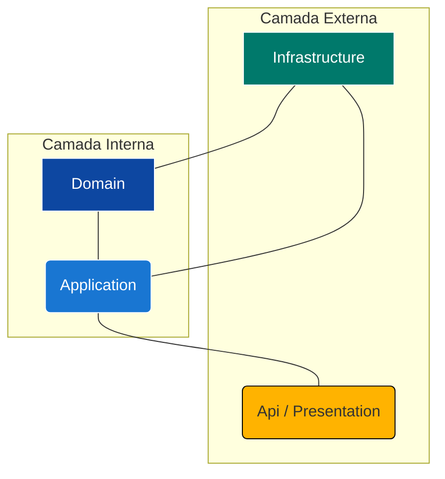

<div align="center">
  
# 🚀 LevelUp API

**Uma API RESTful para Gamificação no Ambiente de Trabalho**

</div>

<p align="center">
  
  
  
  
</p>

---

## 🧑‍💻 Autores

<div align="center">

| Nome | RM |
| :--- | :--- |
| **Wesley Sena dos Santos** | 558043 |
| **Vanessa Yukari Iwamoto** | 558092 |
| **Samara Victoria Ferraz dos Santos** | 558719 |

</div>

---

## 🎯 Sobre o Projeto

O **LevelUp** é uma solução de back-end robusta, construída em .NET 8 com Clean Architecture, projetada para a Global Solution da FIAP com o tema "O Futuro do Trabalho".

O objetivo desta API é centralizar uma plataforma de **gamificação** para engajamento de funcionários. O sistema permite que administradores (como o RH) gerenciem recompensas e que usuários (funcionários) acumulem pontos ao completar tarefas, podendo resgatar esses pontos por itens em uma "loja" interna.

Esta API serve como o "cérebro" econômico do sistema, gerenciando:
* **Identidade:** Registro e autenticação de usuários (Funcionários e Admins).
* **Economia:** O saldo de pontos de cada usuário.
* **Loja:** O catálogo de recompensas (prêmios) e seu estoque.
* **Histórico:** O extrato de resgates de cada usuário.

## ✨ Funcionalidades Principais

Esta API não é apenas um CRUD, mas uma implementação completa de padrões modernos de desenvolvimento:

* **Clean Architecture:** O código é estritamente separado em 4 camadas (`Domain`, `Application`, `Infrastructure`, `Api`) para máxima manutenibilidade e testabilidade.
* **Autenticação JWT:** Acesso seguro usando JSON Web Tokens (Bearer Token) gerados no login.
* **Autorização por Roles:** Endpoints distintos para `USER` (funcionários) e `ADMIN` (RH), utilizando `[Authorize(Roles = "...")]`.
* **Suporte a Múltiplos Bancos:** Projetado para rodar com **Oracle** (localmente) e **SQL Server** (na nuvem) alterando apenas a configuração.
* **Versionamento de API:** Os endpoints são versionados por URL (ex: `/api/v1/Users`), implementado com `Asp.Versioning.Mvc`.
* **HATEOAS:** As respostas (especialmente listas) incluem links de ações (`self`, `update`, `delete`), permitindo que o cliente descubra a API dinamicamente.
* **Exclusão Lógica (Soft Delete):** Usuários e Recompensas não são deletados fisicamente; eles são desativados (`IS_ACTIVE = 'N'`) para manter a integridade do histórico.
* **Validação (DTOs):** Uso de `Data Annotations` nas Entidades e DTOs para garantir a integridade dos dados na entrada.
* **Testes Completos (xUnit):**
    * **Testes de Unidade (Domínio):** Validando as regras das entidades.
    * **Testes de Unidade (Aplicação):** Usando `Moq` para simular os repositórios e testar a lógica de negócio (UseCases).
    * **Testes de Integração (API):** Usando `WebApplicationFactory` para testar os Controllers, HATEOAS e Status Codes.

---

## 🛠️ Tech Stack

O projeto utiliza as seguintes tecnologias:

* **Back-end:** .NET 8 (ASP.NET Core)
* **Arquitetura:** Clean Architecture
* **Banco de Dados:**
    * Azure SQL Server
* **ORM:** Entity Framework Core 8
* **Autenticação:** JWT (Bearer Token)
* **Hashing de Senha:** BCrypt.Net-Next (compatível com Spring Security)
* **Testes:**
    * xUnit (Framework de Teste)
    * Moq (Framework de Mocking)
    * Microsoft.AspNetCore.Mvc.Testing (Testes de Integração)
* **Documentação:** Swagger (OpenAPI) com exemplos customizados (`Swashbuckle.AspNetCore.Filters`)
* **Deploy:** Azure

| Componente | Tipo | Descrição Funcional | Tecnologia/Ferramenta |
| :--- | :--- | :--- | :--- |
| Repositório Git | SCM | Local de versionamento do código | GitHub |
| Pipeline CI | Orquestrador CI | Compila o projeto e executa os testes automáticos | Azure Devops Pipelines |
| Pipeline CD | Orquestrador CD | Deploy automatizado da aplicação e roda as migrações | Azure Devops Pipelines |
| Banco Azure SQL Server | PaaS | Armazenamento dos dados da aplicação | Azure SQL |
| app-levelup-api | Runtime | Local onde a aplicação roda | Azure Web App |

---

## 🏗️ Arquitetura

O projeto segue rigorosamente os princípios da Clean Architecture para garantir a separação de responsabilidades (SoC). O fluxo de dependência é sempre de fora para dentro: as camadas externas (como `Presentation` e `Infrastructure`) dependem das camadas internas (como `Application`), mas as camadas internas nunca dependem das externas.


**Legenda:**

* <span style="color:#0D47A1">**Azul Escuro (Domain):**</span> O núcleo do sistema. Contém as **Entidades** e **Interfaces de Repositório**. Não depende de nada.
* <span style="color:#1976D2">**Azul (Application):**</span> Contém a **lógica de negócio**. Define os **DTOs**, **Mappers** e **UseCases**. Depende apenas do `Domain`.
* <span style="color:#00796B">**Verde (Infrastructure):**</span> A camada de infraestrutura. Implementa as interfaces do `Domain` usando o EF Core (`ApplicationContext`) e os **Repositórios**.
* <span style="color:#FFB300">**Laranja (Api):**</span> A camada de apresentação. Contém os **Controllers**, `Program.cs`, `Dockerfile` e `appsettings.json`. É o único ponto de entrada.

*(Os projetos `LevelUp.Tests` e `LevelUp.Api.Doc` existem para validar e documentar essas camadas.)*

## 🚀 Como Executar Localmente

Este guia pressupõe que você está configurando o ambiente de desenvolvimento principal, que utiliza um banco de dados **Oracle**.

### 1. Pré-requisitos

* [.NET 8 SDK](https://dotnet.microsoft.com/download/dotnet/8.0)
* Um servidor de Banco de Dados **Oracle** (local ou na nuvem) acessível.
* Uma ferramenta de gerenciamento de banco (ex: Oracle SQL Developer, DBeaver).
* (Opcional) Docker Desktop, se for rodar o Oracle em um container.

### 2. Configuração do Banco de Dados

Este projeto utiliza uma abordagem híbrida:
1.  O **.NET (EF Core)** gerencia as tabelas de `Users`, `Teams`, `Rewards`, e `RewardRedemptions` via Migrations.

É crucial seguir esta ordem:

#### Passo 2.1: Configurar a Connection String

1.  No projeto `LevelUp.Presentation`, encontre ou crie o arquivo `appsettings.Development.json`.
2.  Configure-o com suas credenciais do Oracle. Este arquivo **não** deve ser enviado ao Git.

**Arquivo: `LevelUp.Api/appsettings.Development.json`**
```json
{
  "Logging": {
    "LogLevel": {
      "Default": "Information",
      "Microsoft.AspNetCore": "Warning"
    }
  },
  "DatabaseProvider": "Oracle",
  "ConnectionStrings": {
    "DefaultConnection": "Data Source=(DESCRIPTION=(ADDRESS_LIST=(ADDRESS=(PROTOCOL=TCP)(HOST=oracle.fiap.com.br)(PORT=1521)))(CONNECT_DATA=(SERVER=DEDICATED)(SID=ORCL)));User Id=SEU_USER;Password=SUA_SENHA;"
  },
  "Jwt": {
    "SecretKey": "CHAVE_SECRETA_DE_DESENVOLVIMENTO_PODE_SER_QUALQUER_COISA",
    "ExpiresInHours": 8
  }
}
```

#### Passo 2.2: Rodar a Migração do .NET (Criar Tabelas .NET)

1.  Abra o Visual Studio e vá em **Tools > NuGet Package Manager > Package Manager Console**.
2.  No console, configure os dois menus dropdown:
    * **Default project:** `LevelUp.Infra.Data`
    * **Startup project:** `LevelUp.Api`
3.  Execute o comando para aplicar a migração mais recente e criar as tabelas `USERS`, `TEAMS`, `REWARDS`, etc.:
    ```powershell
    Update-Database
    ```

### 3. Configurar um Usuário Admin

Para testar os endpoints protegidos (`[Authorize(Roles = "ADMIN")]`), você precisa de um administrador.

Execute no banco de dados o arquivo SQL Presente em na pasta `/script` nele contém um arquivo chamado `script-bd.sql` que contém um código T-SQL para popular as tabelas do banco de dados incluindo um usuário admin com uma senha padrão:

```
/*
================================================================
 SCRIPT DE POPULAÇÃO - LEVELUP API (AZURE SQL SERVER)
================================================================
*/

-- 1. LIMPEZA DAS TABELAS (Executar em ordem de dependência)
PRINT 'Limpando tabelas...';
DELETE FROM TB_LEVELUP_REWARD_REDEMPTIONS;
DELETE FROM TB_LEVELUP_USERS;
DELETE FROM TB_LEVELUP_REWARDS;
DELETE FROM TB_LEVELUP_TEAMS;
GO

-- Reseta o contador de ID (opcional, mas limpo)
DBCC CHECKIDENT ('TB_LEVELUP_REWARD_REDEMPTIONS', RESEED, 0);
DBCC CHECKIDENT ('TB_LEVELUP_USERS', RESEED, 0);
DBCC CHECKIDENT ('TB_LEVELUP_REWARDS', RESEED, 0);
DBCC CHECKIDENT ('TB_LEVELUP_TEAMS', RESEED, 0);
GO

PRINT 'Inserindo dados...';

-- 2. DECLARAÇÃO DE VARIÁVEIS DE ID
DECLARE @EngTeamID INT;
DECLARE @ProdTeamID INT;
DECLARE @AdminUserID INT;
DECLARE @TestUserID INT;
DECLARE @RewardFoodID INT;
DECLARE @RewardGameID INT;
DECLARE @RewardDayOffID INT;
DECLARE @UserPasswordHash NVARCHAR(1000) = '$2a$12$uF4w2Hk9.ZL1Pxmkvb3EVewXTQ1jXvJ9LrqBghuA5S8CVoCsHL0A.'; -- Senha: LevelUp@123!

-- 3. INSERIR EQUIPES (TEAMS)
INSERT INTO TB_LEVELUP_TEAMS (TEAM_NAME) VALUES ('Equipe de Engenharia');
SET @EngTeamID = SCOPE_IDENTITY();

INSERT INTO TB_LEVELUP_TEAMS (TEAM_NAME) VALUES ('Equipe de Produto');
SET @ProdTeamID = SCOPE_IDENTITY();

-- 4. INSERIR USUÁRIOS (USERS)
INSERT INTO TB_LEVELUP_USERS 
    (FULL_NAME, EMAIL, PASSWORD_HASH, JOB_TITLE, POINT_BALANCE, TEAM_ID, ROLE, IS_ACTIVE, CREATED_AT)
VALUES 
    ('Administrador do Sistema', 'admin@levelup.com', @UserPasswordHash, 'Administrador', 5000, @EngTeamID, 'ADMIN', 'Y', GETDATE());
SET @AdminUserID = SCOPE_IDENTITY();

INSERT INTO TB_LEVELUP_USERS 
    (FULL_NAME, EMAIL, PASSWORD_HASH, JOB_TITLE, POINT_BALANCE, TEAM_ID, ROLE, IS_ACTIVE, CREATED_AT)
VALUES 
    ('Usuário de Teste', 'user@levelup.com', @UserPasswordHash, 'Analista de QA', 1000, @ProdTeamID, 'USER', 'Y', GETDATE());
SET @TestUserID = SCOPE_IDENTITY();

INSERT INTO TB_LEVELUP_USERS 
    (FULL_NAME, EMAIL, PASSWORD_HASH, JOB_TITLE, POINT_BALANCE, TEAM_ID, ROLE, IS_ACTIVE, CREATED_AT)
VALUES 
    ('Usuário Desativado', 'inativo@levelup.com', @UserPasswordHash, 'Ex-Funcionário', 0, NULL, 'USER', 'N', GETDATE());

-- 5. INSERIR RECOMPENSAS (REWARDS)
INSERT INTO TB_LEVELUP_REWARDS 
    (NAME, DESCRIPTION, POINT_COST, STOCK_QUANTITY, IS_ACTIVE, CREATED_AT)
VALUES 
    ('Gift Card iFood R$50', 'Crédito de R$50 no iFood', 500, 100, 'Y', GETDATE());
SET @RewardFoodID = SCOPE_IDENTITY();

INSERT INTO TB_LEVELUP_REWARDS 
    (NAME, DESCRIPTION, POINT_COST, STOCK_QUANTITY, IS_ACTIVE, CREATED_AT)
VALUES 
    ('Gift Card Steam R$100', 'Crédito de R$100 na Steam', 1000, 50, 'Y', GETDATE());
SET @RewardGameID = SCOPE_IDENTITY();

INSERT INTO TB_LEVELUP_REWARDS 
    (NAME, DESCRIPTION, POINT_COST, STOCK_QUANTITY, IS_ACTIVE, CREATED_AT)
VALUES 
    ('Day Off', 'Um dia de folga (não cumulativo)', 3000, 10, 'Y', GETDATE());
SET @RewardDayOffID = SCOPE_IDENTITY();

INSERT INTO TB_LEVELUP_REWARDS 
    (NAME, DESCRIPTION, POINT_COST, STOCK_QUANTITY, IS_ACTIVE, CREATED_AT)
VALUES 
    ('Recompensa Esgotada', 'Item de teste sem estoque', 10, 0, 'Y', GETDATE());

-- 6. INSERIR HISTÓRICO DE RESGATES (REDEMPTIONS)
INSERT INTO TB_LEVELUP_REWARD_REDEMPTIONS 
    (USER_ID, REWARD_ID, REDEEMED_AT, POINTS_SPENT)
VALUES 
    (@AdminUserID, @RewardFoodID, GETDATE() - 7, 500); -- Admin resgatou há 7 dias

INSERT INTO TB_LEVELUP_REWARD_REDEMPTIONS 
    (USER_ID, REWARD_ID, REDEEMED_AT, POINTS_SPENT)
VALUES 
    (@TestUserID, @RewardGameID, GETDATE() - 2, 1000); -- User resgatou há 2 dias
GO

PRINT '✅ Dados de teste inseridos com sucesso!'
PRINT 'Login: admin@levelup.com / user@levelup.com'
PRINT 'Senha: LevelUp@123!'
```

### 4. Executar a Aplicação

Abra um terminal na raiz da solução (pasta do `.sln`) e execute:

```bash
dotnet run --project LevelUp.Presentation
```

Ou simplesmente inicio o projeto `LevelUp.Presentation` no Visual Studio.

Sua API está rodando em:

* **Swagger (UI)**: `http://localhost:[PORTA]/swagger`
* **Health (API)**: `http://localhost:[PORTA]/swagger/api/v1/Health/live`
* **Health (Banco)**: `http://localhost:[PORTA]/swagger/api/v1/ready`

## 🧪 Como Rodar os Testes

O projeto possui uma suíte de testes xUnit completa que valida todas as camadas da aplicação (Domain, Application e Api).

### No Visual Studio

1.  Vá até o menu **Test** na barra superior.
2.  Clique em **Test Explorer**.
3.  Clique no ícone **Run All Tests** (play).

### Pelo Terminal

1.  Abra um terminal na **pasta raiz da solução** (onde está o `LevelUp.sln`).
2.  Execute o comando `dotnet test`:

```bash
dotnet test
```

O .NET O .NET irá compilar a solução e executar todos os testes dos 3 tipos:

* **Testes de Domínio**: Validam as `Entities` (ex `UserEntityTests`).
* **Testes de Aplicação**: Validam a lógica de negócio nos UseCases (ex: `AuthUseCaseTests`, `RewardRedemptionUseCaseTests`) usando `Moq`.
* **Testes de API (Integração)**: Validam os Controllers (ex: `AuthControllerTests`, `UserControllerTests`) usando `WebApplicationFactory`.

## 📖 Guia de Endpoints (API Reference)

A API está versionada e todos os endpoints estão sob o prefixo `/api/v1/`.

* **URL Base (Local):** `http://localhost:[PORTA]/api/v1`
* **URL Base (Deploy):** `http://app-levelup-api.azurewebsites.net/api/v1`

---

## ☁️ Deploy na Azure com CLI

Esta seção detalha como provisionar toda a infraestrutura na Azure e fazer o deploy da aplicação de forma automatizada usando a Azure CLI.

**Pré-requisitos (Azure)**

Antes de executar o script, você precisa preparar seu ambiente:

1. **Instalar a Azure CLI:** A Interface de Linha de Comando da Azure é a ferramenta principal para gerenciar recursos. Se você ainda não a tem, instale-a seguindo as instruções oficiais.
2. **Fazer Login na sua Conta:** Abra seu terminal bash e execute o comando abaixo. Uma janela do navegador será aberta para você se autenticar.

    ```bash
        az login
    ```

3. **Selecionar a Assinatura Correta:** Se você tiver múltiplas assinaturas (subscriptions) na sua conta, é crucial selecionar aquela onde os recursos serão criados.

   * Primeiro, liste todas as suas assinaturas para ver os nomes e IDs:
     ```bash
        az account list --output table
     ```

   * Em seguida, defina a assinatura que deseja usar:
     ```bash
        az account set --subscription "NOME_OU_ID_DA_SUA_ASSINATURA"
     ```
4. **Dar Permissão Para o Arquivo.**: Dê permissões para o arquivo `deploy_azure.sh` para poder ser executado:

    ```bash
        chmod +X deploy_azure.sh
    ```
Com o ambiente configurado, você está pronto para usar o script de deploy com o comando:.

```bash
    ./deploy_azure.sh
```

### Script de Deploy Automatizado

O script a seguir cria todos os recursos necessários (Grupo de Recursos, Banco de Dados SQL, App Service) e faz o deploy da aplicação. Salve o conteúdo abaixo em um arquivo chamado `script-infra.sh` na raiz do projeto.

```
#!/bin/bash

UNIQUE_SUFFIX=$(date +%s)

RESOURCE_GROUP="rg-levelup-api"
LOCATION="canadacentral"
DB_SERVER_NAME="sql-levelup-api-srv"
DB_NAME="levelup_db"
DB_ADMIN_USER="levelupadmin"
DB_ADMIN_PASSWORD="LevelUpP@ssw0rd2025!"
WEB_APP_NAME="app-levelup-api"
APP_SERVICE_PLAN="plan-levelup-api"
JWT_SECRET_KEY="SUA_CHAVE_SECRETA_LONGA_DE_PELO_MENOS_32_CARACTERES_AQUI"

echo "### Iniciando o deploy da API .NET 8 com Azure SQL ###"

echo "--> Criando Grupo de Recursos: $RESOURCE_GROUP..."
az group create --name $RESOURCE_GROUP --location $LOCATION

echo "--> Criando Servidor SQL Lógico: $DB_SERVER_NAME..."
az sql server create \
    --name $DB_SERVER_NAME \
    --resource-group $RESOURCE_GROUP \
    --location $LOCATION \
    --admin-user $DB_ADMIN_USER \
    --admin-password "$DB_ADMIN_PASSWORD"

echo "--> Configurando o firewall do SQL Server..."

echo "--> 1. Permitindo que todos os serviços do Azure se conectem..."
az sql server firewall-rule create \
    --resource-group $RESOURCE_GROUP \
    --server $DB_SERVER_NAME \
    --name "AllowAllWindowsAzureIps" \
    --start-ip-address "0.0.0.0" \
    --end-ip-address "0.0.0.0"

echo "--> 2. Permitindo a conexão da sua máquina local (para SSMS/DBeaver)..."
MY_IP=$(curl -4 -s ifconfig.me)
az sql server firewall-rule create \
    --resource-group $RESOURCE_GROUP \
    --server $DB_SERVER_NAME \
    --name "AllowMyComputer" \
    --start-ip-address $MY_IP \
    --end-ip-address $MY_IP

echo "--> Criando Banco de Dados SQL no modo Serverless (econômico)..."
az sql db create \
    --resource-group $RESOURCE_GROUP \
    --server $DB_SERVER_NAME \
    --name $DB_NAME \
    --edition "GeneralPurpose" \
    --family "Gen5" \
    --capacity 1 \
    --compute-model "Serverless"

echo "--> Criando Plano do App Service (Linux S1)..."
az appservice plan create \
    --name $APP_SERVICE_PLAN \
    --resource-group $RESOURCE_GROUP \
    --location $LOCATION \
    --is-linux \
    --sku S1

echo "--> Criando Web App (Linux .NET 8)..."
az webapp create \
    --name $WEB_APP_NAME \
    --plan $APP_SERVICE_PLAN \
    --resource-group $RESOURCE_GROUP \
    --runtime "DOTNETCORE:8.0"

echo "--> Configurando a conexão do Web App com o Banco de Dados SQL..."

DB_CONNECTION_STRING="Server=tcp:${DB_SERVER_NAME}.database.windows.net,1433;Initial Catalog=${DB_NAME};User ID=${DB_ADMIN_USER};Password=${DB_ADMIN_PASSWORD};Encrypt=True;TrustServerCertificate=False;Connection Timeout=30;"

# Configura as Variáveis de Ambiente no App Service
# O .NET converte "ConnectionStrings:DefaultConnection" para "ConnectionStrings__DefaultConnection"
az webapp config appsettings set \
    --name $WEB_APP_NAME \
    --resource-group $RESOURCE_GROUP \
    --settings \
    "DatabaseProvider=SqlServer" \
    "ConnectionStrings__DefaultConnection=$DB_CONNECTION_STRING" \
    "Jwt__SecretKey=$JWT_SECRET_KEY" \
    "Jwt__ExpiresInHours=8" \
    "ASPNETCORE_ENVIRONMENT=Production"

echo "### ✅ Deploy de Infraestrutura concluído! ###"
echo "🌐 Acesse sua aplicação (após o pipeline de Release) em: https://${WEB_APP_NAME}.azurewebsites.net"
```

#### 🔍 Entendendo o Script Passo a Passo

1. **Configurações Iniciais:** Define variáveis para os nomes dos recursos, localização e credenciais, facilitando a reutilização e manutenção.
2. `az group create`: Cria um Grupo de Recursos, que é um contêiner lógico para agrupar todos os recursos da aplicação.
3. `az sql server create`: Provisiona um servidor SQL lógico na Azure. É nele que nosso banco de dados irá residir.
4. `az sql server firewall-rule create` **(Regra 1)**: Cria uma regra de firewall no servidor SQL que permite o acesso de qualquer serviço da Azure. Isso é essencial para que o nosso Web App consiga se conectar ao banco de dados.
5. `az sql server firewall-rule create` **(Regra 2)**: Adiciona outra regra de firewall para permitir o acesso do seu endereço IP atual. Isso é útil para que você possa se conectar ao banco de dados a partir de ferramentas como DBeaver ou SSMS na sua máquina local.
6. `az sql db create`: Cria o banco de dados em si. O modo --compute-model "Serverless" é uma opção econômica que pausa o banco de dados automaticamente quando não está em uso, ideal para ambientes de desenvolvimento e aplicações com tráfego intermitente.
7. `az appservice plan create`: Cria um Plano do App Service, que define a capacidade computacional (CPU, memória) para a nossa aplicação. O SKU S1 (Standard) é uma boa escolha para produção, oferecendo recursos dedicados.
8. `az webapp create`: Cria a aplicação web (Web App) onde o nosso código .NETCORE será executado. Especificamos o runtime `DOTNETCORE:8.0` para garantir a compatibilidade.
9. `az webapp config appsettings set`: Este é um passo crucial. Ele configura as variáveis de ambiente para a aplicação web. O .NET automaticamente coleta as informações e aplica no appsetting.json.
10. O deploy é feito de maneira automatizada por pipelines no azure devops.

---

### 🔑 Autenticação e Autorização

O acesso à API é controlado por **Tokens JWT (Bearer Token)**.

#### Fluxo de Autenticação

1.  **Registro (`POST /Auth/register`):** Crie um novo usuário.
2.  **Login (`POST /Auth/login`):** Envie o email e senha deste usuário.
3.  **Receber o Token:** A API retornará um JSON contendo o `token`.
4.  **Copiar o Token:** Copie a string `token` (o texto longo que começa com `ey...`).
5.  **Usar o Token:** Para todos os outros endpoints, vá na aba **Authorization** do Postman, selecione **Bearer Token**, e cole o token lá. A API irá ler este token para identificar você e suas permissões (`ROLE`).

---

### 1. Auth Controller
**Endpoint Base:** `/api/v1/Auth`
Controlador anônimo para registro e login.

| Método | Rota | Descrição | Auth | Exemplo de JSON (Body) |
| :--- | :--- | :--- | :--- | :--- |
| `POST` | `/register` | Registra um novo usuário (sempre como "USER"). | `AllowAnonymous` | `(UserCreateRequestSample)` |
| `POST` | `/login` | Autentica um usuário e retorna um Token JWT. | `AllowAnonymous` | `(AuthRequestSample)` |

#### Exemplo de JSON (AuthRequestSample)
```json
{
    "email": "admin@levelup.com",
    "password": "LevelUp@123!"
}
```

#### Exemplo de JSON (UserCreateRequestSample)
```json
{
    "fullName": "Novo Usuário da Silva",
    "email": "novo.usuario@levelup.com",
    "password": "NovaSenha@123",
    "jobTitle": "Analista de QA Jr.",
    "teamId": 1
}
```

---

### 2. User Controller
**Endpoint Base:** `/api/v1/User`
Gerencia os perfis de usuário.

| Método | Rota | Descrição | Auth | Exemplo de JSON (Body) |
| :--- | :--- | :--- | :--- | :--- |
| `GET` | `/me` | Busca o perfil do **próprio** usuário logado. | `USER`, `ADMIN` | (Nenhum) |
| `GET` | `/list` | **[ADMIN]** Lista todos os usuários (paginado). | `ADMIN` | (Nenhum) |
| `GET` | `/{id}` | **[ADMIN]** Busca um usuário por ID. | `ADMIN` | (Nenhum) |
| `PUT` | `/{id}` | **[ADMIN]** Atualiza um usuário (inclui `pointBalance`). | `ADMIN` | `(UserUpdateRequestSample)` |
| `DELETE`| `/{id}` | **[ADMIN]** Desativa (Soft Delete) um usuário. | `ADMIN` | (Nenhum) |

#### Exemplo de JSON (UserUpdateRequestSample)
```json
{
    "fullName": "Usuário Atualizado",
    "email": "usuario.atualizado@levelup.com",
    "jobTitle": "Analista de QA Pleno",
    "role": "USER",
    "teamId": 2,
    "pointBalance": 5000
}
```

---

### 3. Reward Controller
**Endpoint Base:** `/api/v1/Reward`
Gerencia o catálogo da "loja" de recompensas.

| Método | Rota | Descrição | Auth | Exemplo de JSON (Body) |
| :--- | :--- | :--- | :--- | :--- |
| `GET` | `/list` | Lista todas as recompensas (a "loja"). | `USER`, `ADMIN` | (Nenhum) |
| `GET` | `/{id}` | Busca uma recompensa por ID. | `USER`, `ADMIN` | (Nenhum) |
| `POST` | | **[ADMIN]** Cria uma nova recompensa. | `ADMIN` | `(RewardCreateRequestSample)`|
| `PUT` | `/{id}` | **[ADMIN]** Atualiza uma recompensa (nome, custo, estoque). | `ADMIN` | `(RewardUpdateRequestSample)`|
| `DELETE`| `/{id}` | **[ADMIN]** Desativa (Soft Delete) uma recompensa. | `ADMIN` | (Nenhum) |

#### Exemplo de JSON (RewardCreateRequestSample)
```json
{
    "name": "Gift Card Steam R$50",
    "description": "R$50 em créditos para usar na plataforma Steam.",
    "pointCost": 350,
    "stockQuantity": 100
}
```

---

### 4. RedemptionReward Controller
**Endpoint Base:** `/api/v1/RedemptionReward`
Controlador para o fluxo de resgate de pontos.

| Método | Rota | Descrição | Auth | Exemplo de JSON (Body) |
| :--- | :--- | :--- | :--- | :--- |
| `POST` | `/{rewardId}`| Resgata uma recompensa (usa o `userId` do token). | `USER`, `ADMIN` | (Nenhum) |
| `GET` | `/my-history`| Busca o histórico de resgates do usuário logado. | `USER`, `ADMIN` | (Nenhum) |

---

### 5. Team Controller
**Endpoint Base:** `/api/v1/Team`
Gerencia as equipes de funcionários.

| Método | Rota | Descrição | Auth | Exemplo de JSON (Body) |
| :--- | :--- | :--- | :--- | :--- |
| `GET` | `/list` | Lista todas as equipes. | `USER`, `ADMIN` | (Nenhum) |
| `GET` | `/{id}` | Busca uma equipe por ID. | `USER`, `ADMIN` | (Nenhum) |
| `POST` | | **[ADMIN]** Cria uma nova equipe. | `ADMIN` | `(TeamCreateRequestSample)`|
| `PUT` | `/{id}` | **[ADMIN]** Atualiza o nome de uma equipe. | `ADMIN` | `(TeamUpdateRequestSample)`|
| `DELETE`| `/{id}` | **[ADMIN]** Deleta (Hard Delete) uma equipe. | `ADMIN` | (Nenhum) |

#### Exemplo de JSON (TeamCreateRequestSample)
```json
{
    "teamName": "Equipe de Engenharia Alpha"
}
```

---

### 6. Health Controller
**Endpoint Base:** `/api/v1/Health`
Verifica a saúde da aplicação e do banco.

| Método | Rota | Descrição | Auth |
| :--- | :--- | :--- | :--- |
| `GET` | `/live` | Verifica se a API está no ar (saúde da aplicação). | `AllowAnonymous` |
| `GET` | `/ready` | Verifica se a API consegue se conectar ao banco. | `AllowAnonymous` |
